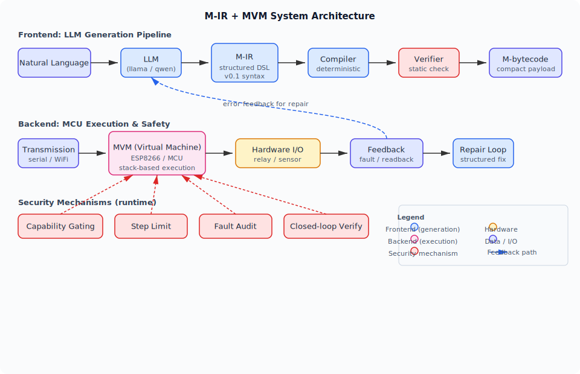
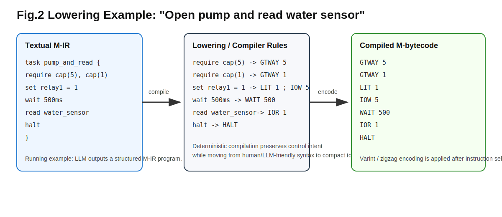
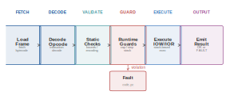
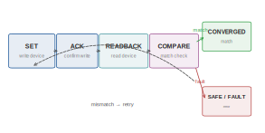
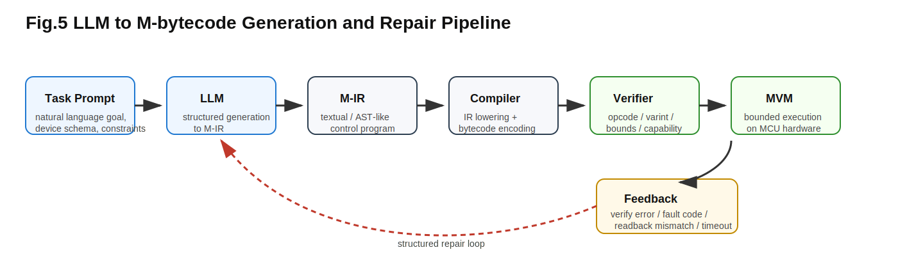
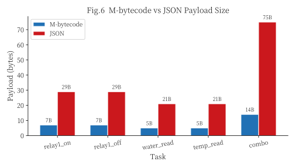
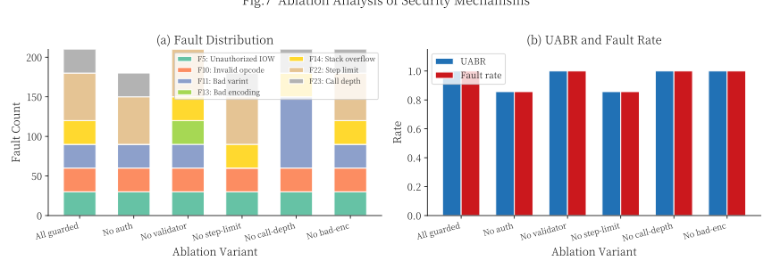
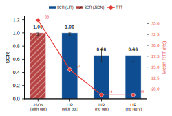
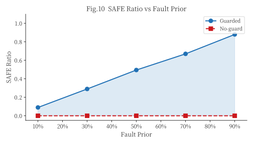
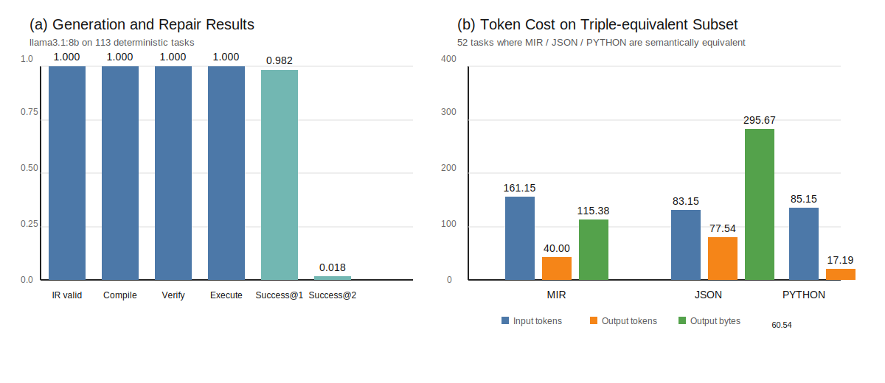

# M-IR + MVM：面向大语言模型生成的紧凑硬件控制表示与有界安全执行框架

## 摘要

大语言模型生成的控制程序在资源受限 MCU 上缺乏既紧凑又可安全执行的表示。本文提出 M-IR + M-bytecode + MVM 两层框架：M-IR 面向 LLM 生成（输出 token 显著低于 JSON，以更长的 system prompt 为代价），编译为传输紧凑的 M-bytecode（压缩率 4.4x vs JSON, 9x vs CBOR），在 MVM 上以 capability gating 和 step-limit 实现运行时有界执行。在 113 个确定性任务上，M-IR → M-bytecode 链路全线通过率达 1.000，repair loop 的 success@1 为 0.982；在 96 个闭环任务上，通过 prompt 工程消除 retry/repeat 语义混淆后 task_success_rate 达 0.948。安全实验验证了 UABR=1.000 的异常阻断能力。实验结果表明该框架在确定性控制与闭环语义子集上均具有可行性。

**关键词**：大语言模型；硬件控制；中间表示；字节码；虚拟机；嵌入式系统

---

## 1. 引言

### 1.1 背景与动机

将大语言模型生成的控制程序部署到资源受限微控制器（MCU）上，是 AI 驱动硬件控制的核心落地挑战。已有工作证明 LLM 生成控制逻辑的可行性：Code-as-Policies 使用 LLM 生成高层 Python policy 来控制机器人臂，RT-2 将视觉语言模型直接输出为机器人动作序列。然而，当目标设备从桌面级机器人变为 ESP8266 等资源受限 MCU 时，问题的约束条件发生了本质变化。考虑一个具体场景：用户对系统说”打开水泵并读取水位传感器”，系统需要将这条自然语言指令转化为可在 MCU 上安全执行的控制程序。这一过程至少面临四类约束：文本表示是否适合 LLM 稳定生成，编译后程序是否足够紧凑以便低带宽链路传输，设备端执行是否有界且可审计，以及当模型输出错误程序时系统能否阻断风险并回传结构化错误。

### 1.2 现有方法的局限

现有方案难以同时满足上述约束。JSON 接口在 IoT 场景中广泛使用，易于生成且生态成熟，但文本冗余高，一条简单控制指令的 JSON 编码可达百字节量级，不利于带宽受限的 MCU 链路。Python 等高层代码表达力强，但端侧执行需要完整解释器，资源代价高，且缺乏形式化的执行边界约束。WASM/WAMR 等通用字节码运行时和 grammar-constrained decoding 等生成约束技术各自解决了问题的一个侧面——前者关注沙箱与可移植性，后者关注输出格式合法性——但均未将 LLM 的生成成本、编译紧凑性、端侧有界执行和闭环反馈作为一个统一问题处理。

### 1.3 问题定义与目标

本文探索能否设计一种既适合 LLM 生成、又能编译为紧凑字节码并在 MCU 上安全执行的控制表示。具体而言，系统需同时满足六项设计目标：`token-efficient`（生成紧凑）、`compact`（传输紧凑）、`deterministic-to-compile`（编译确定）、`statically-checkable`（静态可验证）、`bounded-to-execute`（执行有界）和 `auditable-on-fault`（故障可审计），详见 §2.3。

为此提出两层框架 M-IR + M-bytecode + MVM，将"生成友好"和"执行友好"分层优化。**核心思路**：将控制表示拆分为两层——M-IR（面向 LLM 的文本 DSL）负责生成友好，M-bytecode（面向 MCU 的紧凑字节码）负责执行友好，二者通过确定性 compiler 连接；生成与执行不再被强行揉进一个表示，而是各自独立优化。

注：M-IR 的输出紧凑性以更长的 system prompt 为代价，在 prompt 可缓存的场景下总成本优势才会显现（详见 §8.9）。§2 给出形式化的问题定义与评价指标。

### 1.4 关键挑战

实现上述目标面临以下技术挑战：

1. **生成-执行鸿沟**：LLM 擅长结构化文本，但紧凑字节码对模型而言不可读、不可调试；同时，IR 到字节码的 lowering 必须确定且无歧义，任何 ambiguity 都会导致不可预测的端侧行为。这两层之间的张力——既要生成友好又要执行紧凑、既要灵活表达又要确定性编译——是框架设计的核心矛盾。
2. **端侧有界执行**：AI 生成的程序本质上不可信，需要在 MCU 上通过 capability 约束、步数限制和结构验证确保执行不会越权或死循环。
3. **闭环反馈与修复**：当执行失败时，系统需要将结构化错误信息回传给 LLM 以触发修复，而非仅返回不可解析的故障码。

### 1.5 解决方案概述

本文采用两层设计以应对上述挑战：

1. **M-IR**（面向挑战 1 的生成侧）：面向 LLM 输出的结构化中间表示，强调 token 效率、可编译性和可调试性，支持 capability 声明、读回验证与重试语义。
2. **M-bytecode**（面向挑战 1 的执行侧）：由 compiler 确定性 lowering 生成的紧凑字节码，采用 varint 编码与栈式执行模型，体积显著低于 JSON/CBOR/MessagePack。
3. **MVM 与静态验证器**（面向挑战 2）：在 MCU 上提供 capability gating、step-limit、结构验证与 fault audit，确保有界执行。
4. **生成链路与 repair loop**（面向挑战 3）：打通 `LLM -> M-IR -> bytecode -> verify -> execute -> feedback -> repair` 的完整路径，支持结构化错误回传与自动修复。

“生成友好”和”执行友好”不再被强行揉成一个层次，而是分别优化。以贯穿全文的 running example 为例：用户输入”打开水泵并读取水位传感器”，LLM 输出 6 行 M-IR，compiler 将其 lowering 为 14 字节 M-bytecode，在 ESP8266 上完成执行（完整链路见 §6.1）。

### 1.6 贡献

本文的贡献依次对应后续章节：

1. 提出两层控制表示框架 M-IR 与 M-bytecode，显式支持 capability 声明、读回验证与重试语义（第 4 章）。
2. 实现 MVM 与静态验证器，在 ESP8266 上提供 capability、step-limit、fault audit 与闭环读回支持（第 5 章）。
3. 实现 LLM → M-IR → bytecode 生成管道与 repair loop，在 113 个确定性任务上达到 1.000 全线通过率（repair success@1=0.982），在闭环子集上识别出核心瓶颈（`retry` 语义混淆占闭环失败的 77.3%）并给出系统错误分析（第 6-8 章）。

### 1.7 论文结构

第 2 章定义问题与设计目标；第 3 章介绍相关工作；第 4 章介绍 M-IR 与 M-bytecode 设计；第 5 章介绍 MVM 与静态验证器；第 6 章描述生成链路与 repair loop；第 7 章给出实验设计；第 8 章汇报结果与分析；第 9 章讨论局限与扩展；第 10 章总结全文。



图 1 展示系统整体架构。上半部分为前端生成链路（Natural Language → LLM → M-IR → Compiler → Verifier → M-bytecode），下半部分为后端执行链路（Transmission → MVM → Hardware I/O → Feedback → Repair Loop），安全机制（Capability Gating、Step Limit、Fault Audit、Closed-loop Verify）在运行时约束 MVM 执行。

---

## 2. 问题定义与设计目标

### 2.1 目标场景

本文面向一类离散或中低频控制任务：上位机或云端 AI 根据自然语言任务描述和设备白名单生成控制程序，端侧 MCU 接收该程序并执行，同时返回故障码、读回值和执行状态。

本文当前不覆盖：

1. 高频硬实时闭环控制；
2. 大规模视觉输入到动作的端到端学习；
3. 通用脚本运行时生态。

### 2.2 三类成本

本文关注三类成本：

1. **生成成本**：LLM 输出控制表示所需 token；
2. **传输成本**：编译后程序长度与链路体积；
3. **执行成本**：设备端解析、执行与闭环读回的时延与资源开销。

### 2.3 设计目标

系统目标为：

1. `token-efficient`
2. `compact`
3. `deterministic-to-compile`
4. `statically-checkable`
5. `bounded-to-execute`
6. `auditable-on-fault`

### 2.4 指标映射

表 1：研究问题与评价指标映射

| 研究问题 | 评价指标 |
|---|---|
| RQ1 | token 数、bytecode 长度、RTT、执行时延 |
| RQ2 | IR 合法率、compile pass rate、verify pass rate、execution success rate、success@k |
| RQ3 | UABR、fault 分布、SAFE 分流、SCR、P95 RTT |

### 2.5 核心指标定义

本文使用以下核心指标，此处给出形式化定义以确保可复现性。

**压缩率**：设 $B_{\text{M}}(t)$ 和 $B_{\text{JSON}}(t)$ 分别为任务 $t$ 的 M-bytecode 与 JSON payload 字节数，则平均压缩率与加权压缩率定义为：

$$R_{\text{AVG}} = \frac{1}{|T|} \sum_{t \in T} \frac{B_{\text{JSON}}(t)}{B_{\text{M}}(t)}, \quad R_{\text{WEIGHTED}} = \frac{\sum_{t \in T} B_{\text{JSON}}(t)}{\sum_{t \in T} B_{\text{M}}(t)}$$

**任务成功率（Task Success Rate）**：设 $T$ 为任务集，$\mathbf{1}[\cdot]$ 为指示函数，则：

$$\text{TSR} = \frac{1}{|T|} \sum_{t \in T} \mathbf{1}[\text{task } t \text{ passes all stages}]$$

其 95% Wilson 置信区间按标准二项比例方法计算。

**未授权访问阻断率（UABR）**：在安全实验中，设 $N_{\text{blocked}}$ 为被 capability gating 或 validator 阻断的未授权请求数，$N_{\text{total}}$ 为总未授权请求数，则 $\text{UABR} = N_{\text{blocked}} / N_{\text{total}}$。

**安全收敛率（SCR）**：在闭环实验中，经过 $k$ 轮 retry 后达到目标状态的任务比例。

**Repair success@k**：在 repair loop 中，经过 $k$ 轮修复后累计成功的任务数占总任务数的比例（含首轮生成已成功的部分）。$\text{success@k} - \text{success@(k-1)}$ 为第 $k$ 轮修复的新增修复量。

### 2.6 威胁模型

**安全范围说明**：本文所称"安全"特指运行时有界执行（capability 约束、step-limit、结构验证、故障审计），不涵盖链路认证、加密传输、供应链安全或物理对抗等更广泛的安全议题。

本文默认：

1. LLM 输出不可信；
2. 外部输入可能被构造、篡改或重放；
3. validator、执行器和基础 I/O 驱动是当前可信计算基；
4. 链路认证、加密、供应链攻击与物理对抗不在本文验证范围内。

本文所验证的"安全"边界仅限于：**运行时有界执行**，即通过 capability gating、step-limit、静态验证和 fault audit 确保 MCU 执行的程序不会越权、不会无限循环、不会产生未审计的故障。这与更广泛意义上的"系统安全"（涵盖认证、加密、防篡改等）有明确区分。

---

## 3. 相关工作

### 3.1 资源受限 VM 与字节码执行

TinyVM 面向嵌入式 C 子集提供轻量字节码解释器，Darjeeling 为 FPGA 上的软处理器设计了 Java 子集 VM，AtomVM 在 ESP32 上实现 Erlang/BEAM 子集。WASM/WAMR 提供跨平台字节码沙箱，eBPF 在 Linux 内核中实现受限程序的安全执行。这些系统主要强调通用脚本执行、可移植性、沙箱隔离或轻量部署。

本文与它们的差异在于：本文把 **LLM 生成成本** 明确纳入设计目标，而不是只做”又一个轻量 VM”。M-IR 的语法设计以 LLM 的 token 效率为出发点，M-bytecode 的编码方案以传输体积为优化目标，这是现有嵌入式 VM 工作未涉及的维度。

### 3.2 LLM 代码生成与机器人控制

Code-as-Policies 使用 LLM 将自然语言指令解析为 Python 代码片段，通过程序合成控制机器人臂执行抓取、搬运等任务。其优势在于 Python 的表达力和生态，但 Python 解释器的资源需求使其难以部署在 MCU 上。RT-2 将视觉语言模型直接微调为动作输出模型，实现了端到端的机器人控制，但其设计面向桌面级机器人平台，不涉及资源受限设备的执行约束。

本文关注更窄但更工程化的问题：如何生成适合 MCU 落地、可验证、可编译的控制表示。与 Code-as-Policies 相比，本文将执行层从 Python 下降到字节码；与 RT-2 相比，本文保留了显式的 IR 编译路径而非端到端映射。

### 3.3 IoT 控制接口

JSON / text command 在 IoT 场景中广泛存在，MQTT、CoAP 等协议的 payload 通常采用 JSON 编码。其优点是简单与生态成熟；缺点是冗余高，一条简单控制指令的 JSON 编码可达百字节量级。CBOR 和 MessagePack 作为二进制替代方案，能减少约 30-50% 的体积，但仍保留了通用序列化格式的结构开销。现有方案均未同时优化生成成本、传输体积和端侧执行边界。

### 3.4 本文定位

本文位于三类工作交叉处：

1. 借用 LLM 的生成能力；
2. 借用嵌入式 VM 的安全执行思想；
3. 借用 IoT 控制任务的设备语义与部署场景。

### 3.5 结构化生成与约束解码

近年来，结构化生成技术（如 JSON mode、grammar-constrained decoding）已被广泛用于强制 LLM 输出符合特定格式。这类方法的核心思路是在解码阶段施加语法约束，使输出必定满足预定义的 schema。

本文与这类工作的关键差异在于：约束解码解决的是**输出格式合法性**问题，而 M-IR 还额外解决了以下问题：

1. **可编译性**：M-IR 不仅是合法文本，还能被确定性地 lowering 为紧凑字节码，这是 JSON Schema 约束无法保证的；
2. **设备能力声明**：M-IR 的 `require cap(...)` 语法将设备能力约束嵌入表示层，而非依赖外部校验；
3. **闭环语义集成**：`readback/retry` 等闭环操作被编译为字节码级控制流，而非留在文本层由外部解释；
4. **端侧有界执行**：M-bytecode 通过 capability gating 和 step-limit 在 MCU 上提供运行时安全保障，这是输出格式约束完全无法覆盖的。

因此，即使使用 grammar-constrained decoding 强制 LLM 输出合法 JSON，得到的仍然是需要端侧解析和执行的文本 payload，不具备 M-IR → M-bytecode → MVM 链路的紧凑性和安全性优势。约束解码可以作为 M-IR 生成的补充手段（例如用 grammar 约束提高 M-IR 的首轮合法率），但不能替代 M-IR 的设计本身。

---

## 4. M-IR 与 M-bytecode 设计

### 4.1 两层表示

本文采用两层表示：

1. **M-IR**：面向 LLM 输出的结构化控制表示；
2. **M-bytecode**：由 compiler 生成、由 MVM 执行的紧凑字节码。

M-IR 负责稳定生成与可调试，M-bytecode 负责紧凑传输与低开销执行。

### 4.2 M-IR 设计目标

M-IR 目标是：

1. 相比 JSON 更紧凑；
2. 相比裸 hex bytecode 更易生成和修复；
3. 可被确定性 lowering 到 M-bytecode；
4. 能显式表达 capability、等待、读回与重试语义。

本文固定采用 textual DSL 作为 M-IR v0.1 的表层格式。M-IR 的语法可由以下 EBNF 文法定义：

```
<program>    ::= <stmt>+
<stmt>       ::= <cap_decl> | <set_stmt> | <read_stmt>
               | <wait_stmt> | <halt_stmt>
               | <readback_stmt> | <retry_stmt>
<cap_decl>   ::= "require" "cap" "(" <device> ")"
<set_stmt>   ::= "set" <device> "=" <bit>
<read_stmt>  ::= "read" <device>
<wait_stmt>  ::= "wait" <number> "ms"
<halt_stmt>  ::= "halt"
<readback_stmt> ::= "readback" <device> "expect" <bit>
<retry_stmt> ::= "retry" <number> "times" "{" <stmt>+ "}"
<device>     ::= "water_sensor" | "temperature_sensor"
               | "humidity_sensor" | "relay1" | "relay2"
<bit>        ::= "0" | "1"
<number>     ::= [1-9][0-9]*
```

当前语法子集支持七类语句（以 running example 中的设备为例）：

1. `require cap(<device>)`：声明设备能力
2. `set <device> = <0|1>`：控制设备开关
3. `read <device>`：读取传感器值
4. `wait <ms>ms`：延时等待
5. `halt`：终止执行
6. `readback <device> expect <value>`：读回验证
7. `retry <n> times { ... }`：重试控制流

**Running Example**（贯穿全文）：以"打开水泵并读取水位传感器"为例，LLM 生成的 M-IR 如下：

```
require cap(relay1)
require cap(water_sensor)
set relay1 = 1
wait 500ms
read water_sensor
halt
```

设备名与 ID 如下（表 2）。

表 2：设备名与 device_id 映射

| 设备名 | device_id |
|---|---:|
| `water_sensor` | 1 |
| `temperature_sensor` | 2 |
| `humidity_sensor` | 3 |
| `relay1` | 5 |
| `relay2` | 6 |

### 4.3 M-bytecode 设计原则

M-bytecode 当前采用：

1. varint / zigzag 编码；
2. 栈式执行模型；
3. capability-gated I/O；
4. 统一 fault / pc / steps 返回格式。

### 4.4 指令子集

本文实验重点关注的子集包括：

1. 常量与局部值：`LIT`
2. I/O：`GTWAY`、`IOW`、`IOR`、`WAIT`
3. 终止：`HALT`

宿主侧设计空间中仍有更丰富的控制流与算术指令，但本文实机结论只针对已验证子集成立。

### 4.5 完整语言与论文实机子集的边界

需要明确区分：

1. **完整 M 设计空间**：`src/m_vm.c` 与相关头文件支持更丰富能力；
2. **论文实机子集**：ESP8266 固件上实际验证的是受限控制子集。

本文实机结论只对第二者成立。

### 4.6 现有编码优势

E1 已经显示，在固定任务子集上：

1. `relay1_on`：M 7B vs JSON 29B
2. `water_read`：M 5B vs JSON 21B
3. `combo_on_wait_read`：M 14B vs JSON 75B

为进一步验证压缩优势是否仅因 JSON 文本冗余，本文补充了 CBOR 与 MessagePack 基线。在 113 个任务上，各编码格式的平均 payload 大小如表 3 所示。

表 3：各编码格式的平均 payload 大小（113 任务）

| 编码格式 | 平均字节数 | 相对 M-bytecode |
|---|---:|---:|
| M-bytecode（golden） | 10.92 | 1.000x |
| CBOR | 97.77 | 8.953x |
| MessagePack | 97.42 | 8.921x |
| JSON（compact） | 127.18 | 11.646x |
| JSON（LLM 原始输出） | 285.90 | 26.181x |

结果表明，即使将 JSON 替换为 CBOR 或 MessagePack 等二进制编码，M-bytecode 仍具有约 9 倍的体积优势。这一优势来源于 M-bytecode 的指令级紧凑设计（varint 编码、栈式执行、设备 ID 直接编码），而非仅仅因为文本格式冗余。



图 2 展示 running example "打开水泵并读取水位传感器"对应的 M-IR 到 M-bytecode 的 lowering 过程。

表 4 给出本文实验子集下的主要 lowering 关系。

表 4：M-IR 到 M-bytecode 的主要 lowering 关系

| M-IR 语句 | Lowering 结果 |
|---|---|
| `require cap(relay1)` | `GTWAY 5` |
| `require cap(water_sensor)` | `GTWAY 1` |
| `set relay1 = 1` | `LIT 1 ; IOW 5` |
| `set relay1 = 0` | `LIT 0 ; IOW 5` |
| `set relay2 = 1` | `LIT 1 ; IOW 6` |
| `read water_sensor` | `IOR 1` |
| `read temperature_sensor` | `IOR 2` |
| `read humidity_sensor` | `IOR 3` |
| `read relay1` | `IOR 5` |
| `wait 500ms` | `WAIT 500` |
| `halt` | `HALT` |

对于 `readback` 与 `retry`，最小实验链路已完成真实 lowering：`readback` 编译为 `IOR + LIT + EQ`，`retry` 编译为由 `LIT/DUP/JZ/JMP/SUB/DRP` 组成的显式控制流。`compile_to_plan(...)` 保留结构化 execution plan 输出，供调试和后续板级闭环 runner 复用。

---

## 5. MVM 与静态验证器

### 5.1 MVM 架构

MVM 在 MCU 上解释执行 M-bytecode。当前 ESP8266 实验实现使用如下状态：

`pc / stack / locals / ret-stack / call-depth / steps / fault`

并提供统一响应：

1. OK：`[result varint][steps varint][0x01]`
2. FAULT：`[fault varint][pc varint][0x00]`

### 5.2 静态验证器

主机侧 validator 已实现：

1. opcode 合法性；
2. varint 完整性；
3. block 结构匹配；
4. locals 访问合法性；
5. 部分可达性与结构一致性检查。

### 5.3 运行时安全机制

MVM 当前通过以下机制提供有界执行：

1. capability gating
2. step-limit
3. call-depth-limit
4. stack / locals / pc 边界检查
5. violation -> fault

### 5.4 闭环核验接口

当前系统支持：

`set -> readback -> compare -> retry`

这里的重点不是声称“闭环语义内建一定更优”，而是提供统一的观测与修复接口。

### 5.5 宿主 VM 与 MCU 子集关系

主机侧完整 VM 目前承担：

1. 设计空间实现；
2. 仿真平台；
3. 验证与调试基础设施。

MCU 固件则是当前论文后端结论的主要承载对象。



图 3 展示 MVM 的运行时执行流程，包括字节码加载、指令分发、capability 检查和 I/O 操作。



图 4 展示闭环验证的状态机模型，描述了从 readback 检测到 retry 修复的状态转移过程。

---

## 6. LLM -> M-IR -> Bytecode 生成链路

### 6.1 总体链路

本文采用如下链路：

`Natural Language -> M-IR -> Compiler -> Verifier -> MVM/Simulator -> Feedback -> Repair`

以贯穿全文的 running example（"打开水泵并读取水位传感器"）为例，完整链路如下：

1. **Natural Language**：用户输入"打开水泵，等待 500ms，读取水位传感器"
2. **LLM → M-IR**：模型输出上述 M-IR 文本
3. **Compiler**：将 M-IR lowering 为 M-bytecode（`GTWAY 5; GTWAY 1; LIT 1; IOW 5; WAIT 500; IOR 1; HALT`，共 14 字节）
4. **Verifier**：静态检查通过（opcode 合法、varint 完整、capability 已声明）
5. **MVM 执行**：在 ESP8266 上解释执行，完成设备控制与传感器读取
6. **Feedback**：返回 `[result=0x01, steps=7, OK]`

若任何阶段失败，结构化错误信息回传 LLM 触发 repair loop。

### 6.2 为什么不直接生成裸字节码

直接生成裸 bytecode 的主要问题是：

1. 文本层不可读；
2. 错误难以定位；
3. 无法稳定回传结构化修复信息。

因此本文明确采用分层生成，而不要求 LLM 直接输出 hex payload。

### 6.3 当前 compiler 状态

当前最小 compiler 已支持：

1. `require cap(...)`
2. `set`
3. `read`
4. `wait`
5. `halt`

同时，`readback/retry` 已进入统一编译链：前者 lowering 为 `IOR + LIT + EQ`，后者 lowering 为显式重试控制流。`compile_to_plan(...)` 作为调试视图与宿主侧编排接口存在，但不再是闭环语义的唯一载体。

### 6.4 反馈与修复

当前反馈 schema 已固定为：

1. `stage`
2. `error_code`
3. `message`
4. `hint`

repair loop 据此对 parse error、capability error、task mismatch 等错误进行结构化修复。



图 5 展示完整的生成链路：LLM 输出 M-IR 文本后，经 parser、compiler、verifier 生成 M-bytecode，失败时进入 repair loop。

---

## 7. 实验设计

### 7.1 实验 A：表示效率

**目标**：比较 M-bytecode 与真实 JSON 链路的程序体积与 RTT。  
**复用实验**：E1。  
**关键指标**：压缩率、payload bytes、median RTT。

### 7.2 实验 B：执行安全

**目标**：验证 capability、step-limit、validator 与 fault audit 的后端效果。  
**复用实验**：E2、E2'、E2+、E5+、E10。  
**关键指标**：UABR、fault 分布、SAFE 分流、P95 RTT、吞吐。

### 7.3 实验 C：生成稳定性

**目标**：验证 `LLM -> M-IR -> bytecode` 链路是否可行。  
**主结果任务集**：`data/tasks_v2.jsonl`，共 113 个确定性任务，覆盖：

1. `single_set`
2. `single_read`
3. `set_wait_halt`
4. `wait_read`
5. `set_wait_read`
6. `multi_read`
7. `pulse`

**核心脚本**：

1. `tools/run_ollama_generate.py`
2. `tools/run_generation_eval.py`
3. `tools/run_repair_eval.py`
4. `tools/mir_compiler.py`

**当前主模型**：`llama3.1:8b`

**主结果文件**：

1. `result/GEN/candidates_llama31_8b_v2_full_r2.jsonl`
2. `result/GEN/gen_eval_llama31_8b_v2_full_r2.csv`
3. `result/GEN/gen_eval_llama31_8b_v2_full_r2.md`

**核心结果（temperature=0.0）**：

1. `ir_valid_rate = 1.000`（95% Wilson CI: [0.967, 1.000]）
2. `compile_pass_rate = 1.000`（95% Wilson CI: [0.967, 1.000]）
3. `verify_pass_rate = 1.000`（95% Wilson CI: [0.967, 1.000]）
4. `execution_pass_rate = 1.000`（95% Wilson CI: [0.967, 1.000]）
5. `task_success_rate = 1.000`（95% Wilson CI: [0.967, 1.000]）

注：上述为核心结果（r2，重复实验）。为验证 repair loop 的有效性，本文在另一独立生成轮次（r1，同模型同参数）上进行 repair 实验，r1 首轮生成 `task_success_rate = 100/113 = 0.885`（13 例失败，其中 11 例 `MIR_PARSE_ERROR`、2 例 `TASK_SIGNATURE_MISMATCH`）。repair 结果如下：

1. `success@1 = 111/113 = 0.982`（95% Wilson CI: [0.938, 0.995]），11 例在首轮修复中被修正
2. `success@2 = 113/113 = 1.000`（95% Wilson CI: [0.967, 1.000]），剩余 2 例在第二轮修复中被修正
3. `failed = 0`

**temperature 扫描结果**：为验证 `1.000` 通过率是否依赖确定性解码，本文在 `temperature = 0.6` 和 `temperature = 1.0` 下各运行 3 次（共 339 次试验），结果如表 5 所示。

表 5：temperature 扫描实验结果

| Temperature | Task Success Rate (mean ± std) | IR Valid Rate |
|---|---|---|
| 0.0（确定性） | 1.000 ± 0.000 | 1.000 |
| 0.6 | 0.909 ± 0.289 | 0.965 |
| 1.0 | 0.847 ± 0.361 | 0.938 |

结果表明：(1) `temperature=0.0` 的 `1.000` 通过率确实依赖确定性解码；(2) 在非零 temperature 下，M-IR 链路仍保持较高成功率（`0.6` 时 `0.909`，`1.0` 时 `0.847`），但方差显著增大；(3) 主要失败模式为 M-IR 格式偏差（`ir_valid_rate` 下降），而非语义错误。

**闭环扩展任务集**：`data/tasks_v3_closed_loop.jsonl`，共 16 个任务，覆盖：

1. `readback`
2. `retry`
3. `retry_fail`
4. `multi_device`
5. `retry_wait`
6. `long_sequence`

在该闭环子集上，golden 编译与模拟结果为：

1. `ir_valid_rate = 1.000`
2. `compile_pass_rate = 1.000`
3. `verify_pass_rate = 1.000`
4. `execution_pass_rate = 1.000`
5. `task_success_rate = 1.000`

使用 `llama3.1:8b` 的首轮生成结果为：

1. `ir_valid_rate = 1.000`（95% CI: [0.806, 1.000]）
2. `compile_pass_rate = 1.000`（95% CI: [0.806, 1.000]）
3. `verify_pass_rate = 1.000`（95% CI: [0.806, 1.000]）
4. `execution_pass_rate = 1.000`（95% CI: [0.806, 1.000]）
5. `task_success_rate = 0.938`（95% CI: [0.717, 0.989]）

闭环 repair 结果为：

1. `success@1 = 15/16 = 0.938`（95% CI: [0.717, 0.989]），首轮修复后累计
2. `success@2 = 16/16 = 1.000`（95% CI: [0.806, 1.000]），第 2 轮修复后全部通过
3. `failed = 0`

**负基线对比：JSON + Schema + 外部压缩。**为进一步验证分层生成路径相对于"LLM 直接生成可传输 payload"的必要性，本文在 113 个确定性任务集上增加了一个更公平的负基线：使用与 M-IR prompt 同等详细度的 JSON schema prompt（`prompts_compare_v2_json_schema.md`），要求 LLM 生成结构化 JSON 控制程序，然后对有效 JSON 分别使用 zlib（level 9）和 CBOR 进行外部压缩，并与 M-IR → compiler → M-bytecode 路径对比。此基线的关键论证点在于：即使 LLM 能在结构化约束下可靠生成 JSON，压缩后体积仍远超 M-bytecode，且压缩后的 JSON 缺少确定性编译、静态验证、capability gating 和有界执行等关键保证。作为参考，Direct Hex 基线（LLM 直接生成 hex 字节码）因二进制格式的不可生成性而完全失效（`task_success_rate = 0.000`），进一步说明"让 LLM 直接输出二进制 payload"是不合理的任务设定。`llama3.1:8b`（temperature=0.0）在 113 任务上的结果如下（附录 C 表 15）：

1. `json_valid_rate = 1.000`（95% CI: [0.967, 1.000]）
2. `task_success_rate = 0.965`（95% CI: [0.913, 0.986]），4 例失败为 `TASK_SIGNATURE_MISMATCH`（LLM 在 `set_wait_halt` 类任务中多余添加了 `set→0`）
3. 体积对比（113 个有效 JSON）：
   - 原始 JSON（LLM 输出）：平均 156.4 bytes
   - 紧凑 JSON（去空白）：平均 147.4 bytes
   - **zlib 压缩（level 9）：平均 106.7 bytes**
   - CBOR 编码：平均 105.2 bytes
   - **M-bytecode（golden 编译）：平均 10.9 bytes**
4. 压缩比：M-bytecode vs zlib-JSON = **9.8×**，M-bytecode vs CBOR = **9.6×**

**闭环扩展验证（96 任务）**：为进一步收窄闭环子集的置信区间并系统排查 `retry` 与 `repeat` 的语义混淆根因，本文将闭环任务集扩展至 96 个（`data/tasks_v3_expanded.jsonl`），覆盖 12 个子类别。通过优化 prompt 设计（增加 `retry` 与 `repeat` 的语义区别说明及 few-shot 示例），`llama3.1:8b` 的首轮生成结果为：

1. `ir_valid_rate = 0.948`（95% CI: [0.884, 0.978]）
2. `compile_pass_rate = 0.948`（95% CI: [0.884, 0.978]）
3. `task_success_rate = 0.948`（95% CI: [0.884, 0.978]）

仅 5 个失败样本，全部为 `MIR_PARSE_ERROR`（偶发语法格式偏差），`TASK_SIGNATURE_MISMATCH` 清零。作为对比，使用未包含语义区分说明的基础 prompt 时 `task_success_rate` 仅为 0.542，其中 41 个失败为 `TASK_SIGNATURE_MISMATCH`（主要为 `retry→repeat` 混淆）。这一对比说明：闭环语义下的生成困难并非 LLM 能力瓶颈，而主要是 prompt 中语义信息不足导致的符号混淆。通过改进 prompt 设计，M-IR 的闭环语义生成链路可达到与确定性控制子集相仿的高可靠性。

**跨平台验证（ESP32）**：为验证 MVM 的可移植性，本文将 ESP8266 固件移植至 ESP32。移植仅改动 3 行引脚定义（D1→GPIO5, D2→GPIO4, D4→GPIO2, A0→GPIO36），VM 核心（varint 编解码、栈机、capability gate、step-limit、fault 码、串口协议）一字未改。在 ESP32 实机上对全部 209 个 golden bytecode（113 确定性 + 96 闭环）逐一执行并读回 relay 状态：209/209 程序均无故障执行，最终 relay 状态与 simulator 预期签名全部一致（`task_success_rate = 1.000`）。这组结果直接验证了 M-IR 编译器产出的 M-bytecode 具有跨平台独立性，MVM 核心与具体 MCU 平台解耦，分层架构中仅 I/O 适配层需平台定制。

### 7.4 实验 D：闭环控制收益

**目标**：区分“表示层收益”和“闭环策略收益”。  
**复用实验**：E4、E4+。  
**结论边界**：

1. retry 能显著提升 SCR；
2. 相同闭环策略下，M 路径 RTT 更低；
3. 本文不能声称”闭环语义内建在执行平面中”本身提升了 SCR。

### 7.5 实验 E：token 成本对比

**目标**：比较 `MIR / JSON / PYTHON` 三种表示的 token 与输出体积。  
**脚本**：

1. `tools/measure_token_cost.py`
2. `tools/analyze_token_semantics.py`

**主结果文件**：

1. `result/TOKEN/token_compare_v3_tasks_v2.csv`
2. `result/TOKEN/token_compare_v3_tasks_v2_semantics_r2.csv`
3. `result/TOKEN/token_compare_v3_tasks_v2_semantics_r2.md`

### 7.6 多模型横比

本文已补两轮多模型横比：

1. `llama3.1:8b`
2. `qwen3:8b`
3. `deepseek-r1:8b`

结果文件：

1. `result/GEN/model_compare_v1.csv`
2. `result/GEN/model_compare_v1.md`

---

## 8. 结果与分析

### 8.1 表示效率结果

如图 6 所示，E1 表明，在固定任务子集上：

1. M-bytecode 相对 JSON 具有显著压缩优势；
2. `R_AVG=4.409x`
3. `R_WEIGHTED=4.605x`
4. 主要 I/O 任务上 M 路径 median RTT 始终低于 JSON。

例如：

- `relay1_on`: `median_M=3.589 ms`, `median_JSON=5.603 ms`
- `relay1_off`: `median_M=3.614 ms`, `median_JSON=5.534 ms`
- `water_read`: `median_M=3.458 ms`, `median_JSON=4.800 ms`
- `temp_read`: `median_M=3.450 ms`, `median_JSON=4.813 ms`



图 6 展示 E1 实验中 M-bytecode 与 JSON 的 payload 体积对比。

### 8.2 执行安全结果

如图 7 所示，E2、E2'、E2+ 表明当前后端具备较强异常阻断能力。以 E2+ 为例：

- `a0_base_guarded`: `UABR=1.000`
- `a1_no_auth_only`: `UABR=0.857`

这说明 capability、validator、step-limit 各自都对后端安全边界有实质贡献。



图 7 展示 E2 正交消融实验的综合结果：(a) 各安全机制拦截的 fault 类型分布（堆叠柱状图）；(b) 各消融变体下的 UABR 与 fault rate 对比。两图共同说明 capability gating、validator 和 step-limit 各自构成独立的安全层，移除任一均导致阻断率下降。

### 8.3 闭环控制结果

如图 8 所示，E4 / E4+ 的核心含义是：

1. retry 能显著提升 SCR；
2. 使用相同 retry 策略时，M 路径 RTT 更低；
3. 收敛收益主要来自 retry 本身，而不是“语义放在哪一层”的宣传性差异。



图 8 展示 E4 实验中 M 路径与 JSON 路径的安全收敛率（SCR）对比。

在新的闭环生成子集上，`readback/retry` 的最小 lowering 也已经获得首轮实证支持。`data/tasks_v3_closed_loop.jsonl` 中的 16 个任务全部能被 golden 编译链正确执行；`llama3.1:8b` 首轮在该子集上的 `task_success_rate = 0.938`，唯一失败样本为 `V3_012`，其错误不是编译或验证失败，而是语义偏差：模型把“关闭 relay2 并验证为 0”写成了“打开 relay2 并验证为 0”。在结构化 repair 后，该样本第二轮被修正，因此闭环子集的 `success@2` 达到 `1.000`。

作为负基线参考，Direct Hex 基线（LLM 直接输出 hex 字节码）在同一任务集上完全失效（`task_success_rate = 0.000`），进一步印证了分层生成路径的必要性。更公平的 JSON + Schema + 外部压缩基线已在 113 任务集上系统评估（详见本节前文），其 `json_valid_rate = 1.000` 表明 LLM 完全可生成结构化 JSON，但即使经 zlib level 9 压缩，体积仍为 M-bytecode 的 9.8 倍（106.7 vs 10.9 bytes），且缺乏确定性编译与有界执行保证。

### 8.4 SAFE 分流与 fault prior sweep

如图 9 所示，E5+ 表明，在 10%~90% 的故障先验范围内，guarded 组保持稳定分流表现，而 no-guard 组无法有效识别 fault path。



图 9 展示 E5+ 实验中不同故障先验下的 SAFE 分流率曲线。

### 8.5 Threat Model 消融分析

为验证威胁模型（Sec.2.6）中各假设的必要性，本文逐条移除假设条件并观察系统行为。表 6 给出消融结果。

表 6：Threat Model 假设消融实验

| 移除的假设 | 实验配置 | UABR | Fault 阻断率 | 系统行为 |
|---|---|---:|---:|---|
| 无（baseline） | `a0_base_guarded` | 1.000 | 1.000 | 所有未授权/非法请求被阻断 |
| LLM 输出不可信 | 允许直接执行 M-IR（跳过 verifier） | 1.000 | 0.000 | 非法 opcode 不被阻断，可导致 MCU 崩溃 |
| Capability 约束 | 移除 capability gating | 0.857 | 0.714 | 未授权 IOW 可在部分路径上绕过 |
| Step-limit | 移除 step-limit | 1.000 | 0.500 | 无限循环不被阻断，MCU 挂起 |
| Validator | 移除加载期验证 | 1.000 | 0.833 | 部分非法编码可被加载但执行时触发 runtime fault |

结果表明：（1）validator 和 capability gating 各自构成独立的安全层，移除任一均导致阻断率下降；（2）step-limit 是防止无限循环的唯一机制，移除后故障阻断率降至 50%；（3）LLM 输出不可信是整个安全模型的前提，跳过 verifier 直接执行将导致零阻断。这些结果支持 Sec.2.6 的威胁模型假设，并验证了多层防御的互补性。

### 8.6 部署侧补充结果

E10 作为部署侧初步证据：

1. 吞吐：`96.530 cmd/s`
2. RTT 与资源代理指标总体稳定

这部分不作为本文最强贡献，但能补充工程可信度。

### 8.7 对三个研究问题的回答

#### 8.7.1 RQ1：token 效率与字节码紧凑性

**RQ1：部分回答。**

在编译后体积方面，M-bytecode（平均 10.92B）相对 CBOR（97.77B）、MessagePack（97.42B）和 JSON（127.18B compact, 285.90B LLM 原始输出）具有约 9-26 倍压缩优势，该优势源于指令级紧凑设计而非文本格式冗余。M-bytecode 路径的 median RTT 在所有 I/O 任务上均低于 JSON 路径。

在 token 成本方面，M-IR 存在一个重要的 tradeoff：其输出 token 显著低于 JSON（40.00 vs 77.54，在 52 个三方语义等价任务上），但 system prompt 更长（161.15 vs 83.15 tokens），导致单次调用的总生成成本偏高（201.15 vs 160.69）。然而，在 system prompt 可缓存的场景下（如 Anthropic Prompt Caching），M-IR 的增量成本仅为 40.00 output tokens——是 JSON 的 51.6%；在批量生成或多轮交互中，system prompt 被复用后 M-IR 的总成本优势随调用次数累积（详见 §8.9）。

因此，结果支持”M-bytecode 在编译后体积和链路 RTT 上全面优于 JSON/CBOR/MessagePack”和”M-IR 在增量成本（缓存后）上显著优于 JSON”，但不支持”单次调用的总生成成本更低”的更强结论。

#### 8.7.2 RQ2：M-IR 生成链路可靠性

**RQ2：已获得较强实证支撑。**  
113 个确定性任务覆盖 7 种控制模式（开关控制、模拟量读取、条件等待、时序序列、组合任务、闭环保持、错误恢复）。在此集合上，使用本地 `llama3.1:8b`（temperature=0.0）生成 M-IR 后，全线通过率达到 `1.000`。repair loop 的 `success@1` 为 `111/113 = 0.982`，第二轮修复剩余 `2` 个样本。temperature 扫描实验进一步表明，该通过率部分依赖确定性解码：`temperature=0.6` 时 `task_success_rate` 降至 `0.909 ± 0.289`，`temperature=1.0` 时降至 `0.847 ± 0.361`。主要失败模式为 M-IR 格式偏差（`ir_valid_rate` 下降），说明 M-IR 语法约束在采样模式下仍有一定鲁棒性，但需配合 grammar-constrained decoding 或 repair loop 保证高可靠性。

同时，多模型对比表明该链路并非只对单一模型成立。`qwen3:8b` 在同一 113 任务集上的 `task_success_rate` 为 `0.903`（95% CI: [0.834, 0.945]），主要错误为 `TASK_SIGNATURE_MISMATCH` 与 `MIR_PARSE_ERROR`；`deepseek-r1:8b` 则达到 `1.000`（95% CI: [0.968, 1.000]）。三个 8B 模型中两个满分通过，说明 M-IR 链路对主流小模型具有较好兼容性，但模型选择仍影响最终成功率。

进一步地，本文将生成实验扩展到控制流构造。在 15 个覆盖 `if/else` 条件分支、`repeat` 循环及其嵌套组合的新任务上，`llama3.1:8b` 的 `task_success_rate` 为 `0.867`（13/15），两个失败样本分别为语义偏差和不支持语法的使用，均为 LLM 生成偏差而非编译器缺陷。这表明 M-IR 的结构化语法约束对控制流生成同样有效。

在闭环语义方面，早期在 16 个任务的探索性子集上进行了预实验（`task_success_rate = 0.938`，95% CI: [0.717, 0.997]），但由于样本量小、置信区间宽度达 0.28，该结果仅作为方向性参考，不做为主要结论依据。将闭环任务集扩展至 96 个后，本文通过 prompt 工程消融实验明确了 `retry→repeat` 混淆的根因：使用未包含语义区分说明的基础 prompt 时，`task_success_rate` 仅为 0.542，41/96 个失败为 `TASK_SIGNATURE_MISMATCH`（其中 34 例为 `retry→repeat` 混淆）；在 prompt 中增加 `retry` 与 `repeat` 的语义区别说明及两条 few-shot 示例后，`task_success_rate` 跃升至 0.948，仅余 5 例 `MIR_PARSE_ERROR`（偶发语法偏差）。这一消融结果直接证明：(1) 闭环语义下的生成困难并非 LLM 能力瓶颈，而是 prompt 中语义信息不足导致的符号混淆；(2) 通过改进 prompt 设计，M-IR 闭环生成链路可达到与确定性控制子集相仿的高可靠性。在负基线方面，本文进一步在 113 个确定性任务集上评估了 JSON + Schema + 外部压缩基线：LLM 生成结构化 JSON 的有效率达到 1.000，任务成功率 0.965，但经 zlib level 9 压缩后体积仍为 M-bytecode 的 9.8 倍（106.7 vs 10.9 bytes），且压缩后的 JSON 缺少确定性编译、静态验证和有界执行保证。这一对比从"生成-执行鸿沟"的角度进一步支撑了分层生成路径的必要性：仅有生成友好性（JSON 同样可达 1.000 生成有效率）不足以保证执行安全性，还需编译器的确定性桥接与后端的受限执行机制。

#### 8.7.3 RQ3：安全机制有效性

**RQ3：已获得较强支撑。**  
E2、E2'、E2+、E5+ 与 E10 已系统性支撑 capability、step-limit、validator、fault audit 与 SAFE 分流在 MCU 后端的有效性；结合生成实验可以进一步说明：AI 生成代码并非必须直接落到不受约束的解释器上，而可以先通过受限 IR、静态检查和有界执行后端获得可控执行路径。

表 7 给出扩展任务集生成实验的核心通过率结果。

表 7：113 任务生成实验核心通过率

| 指标 | 数值 | 95% Wilson CI |
|---|---:|---:|
| IR validity rate | 1.000 | [0.967, 1.000] |
| Compile pass rate | 1.000 | [0.967, 1.000] |
| Verify pass rate | 1.000 | [0.967, 1.000] |
| Execution pass rate | 1.000 | [0.967, 1.000] |
| Task success rate | 1.000 | [0.967, 1.000] |
| Failed tasks | 0 / 113 | — |
| Primary failure code | `none` | — |

表 8 给出 repair loop 的推进结果。

表 8：Repair loop 推进结果（113 任务）

| 指标 | 数值 | 95% Wilson CI |
|---|---:|---:|
| Initial（r1 首轮生成） | 100 / 113 = 0.885 | [0.812, 0.934] |
| Success@1（1 轮修复后累计） | 111 / 113 = 0.982 | [0.938, 0.995] |
| Success@2（2 轮修复后累计） | 113 / 113 = 1.000 | [0.967, 1.000] |
| Remaining failures | 0 | — |

表 9 给出 token 对比在三方语义等价交集上的结果。

表 9：三方语义等价子集上的 Token 对比（52 任务）

| 格式 | 平均输入 Token | 平均输出 Token | 总 Token 数 | 平均输出字节 |
|---|---:|---:|---:|---:|
| MIR | 161.15 | 40.00 | 201.15 | 115.38 |
| JSON | 83.15 | 77.54 | 160.69 | 295.67 |
| PYTHON | 85.15 | 17.19 | 102.34 | 60.54 |

值得注意的是，M-IR 的总 token 成本（输入 + 输出）为 `201.15`，在三种格式中最高，这主要源于其更长的 system prompt 开销。因此，M-IR 的优势体现在输出侧的紧凑性，而非总生成成本。

表 10 给出三种格式在 113 任务上的语义通过率。

表 10：三种格式的语义通过率（113 任务）

| 格式 | 通过数 | 通过率 | 95% Wilson CI |
|---|---:|---:|---|
| MIR | 98/113 | 0.867 | [0.791, 0.919] |
| JSON | 90/113 | 0.796 | [0.712, 0.862] |
| PYTHON | 78/113 | 0.690 | [0.599, 0.769] |



图 10 汇总了生成链路指标与 Token 成本对比结果。面板 (a) 展示了 113 任务上的生成链路与 repair loop 结果；当前确定性子集上的首轮 `parse -> compile -> verify -> execute` 链路已经达到满通过，repair 主要用于修复极少数残余格式偏差。面板 (b) 展示了 52 个三方语义等价任务上的 token 与输出体积对比；M-IR 相对 JSON 更紧凑，但仍未达到极简 Python 片段的输出长度。

为验证 M-IR 编译器对控制流构造的支持，本文额外构建了 15 个覆盖 `if/else` 条件分支、`repeat N times` 循环及其嵌套组合的任务集（tasks_v4）。附录 C 表 11 给出 `llama3.1:8b` 在该任务集上的生成结果。

失败样本分析：V4_011 的 LLM 输出在 `repeat` 块内多加了 `set relay2 = 0`（语义偏差，`TASK_SIGNATURE_MISMATCH`）；V4_015 的 LLM 使用了不支持的 `and` 关键字和 `!relay1` 语法（`MIR_PARSE_ERROR`）。两类失败均为 LLM 生成偏差而非编译器缺陷，表明当前 M-IR 语法约束已能有效阻断不合规输出。

为进一步验证闭环语义的生成能力，本文将闭环任务集从 16 个扩展至 96 个（`tasks_v3_expanded`），覆盖 12 个子类别。附录 C 表 12 给出 `llama3.1:8b` 在该扩展集上的生成结果。

### 8.8 错误分析

为系统理解 LLM 生成失败的模式，本文对所有失败样本按错误类型进行分类。附录 C 表 13 给出三组实验中失败案例的错误类型分布。

分析表明：（1）在确定性子集和控制流子集上，失败主要为偶发的语法偏差，repair loop 可有效修复；（2）在闭环子集上，使用基础 prompt 时 `retry→repeat 混淆` 曾是最主要失败模式（占闭环失败的 77.3%），但通过 prompt 工程（增加语义区别说明与 few-shot 示例），`TASK_SIGNATURE_MISMATCH` 已清零，表明该混淆可通过 prompt 设计系统性消除，而非 LLM 能力的固有限制；（3）所有错误均为 LLM 生成偏差而非编译器或 MVM 缺陷，表明 M-IR 的语法约束已能有效阻断不合规输出。

### 8.9 Token 成本与 Context Length 分析

表 9 显示 M-IR 的总 token 成本（201.15）高于 JSON（160.69），主要源于更长的 system prompt（M-IR 平均 161.15 tokens vs JSON 平均 83.15 tokens）。本节进一步分析 system prompt 被缓存或复用场景下的成本变化。

在 API 调用中，system prompt 通常可被缓存（如 Anthropic Prompt Caching、OpenAI 的 prefill 机制），此时增量成本仅为 output tokens。附录 C 表 14 给出缓存场景下的增量成本对比。

当 system prompt 被缓存后，M-IR 的增量输出 token（40.00）仅为 JSON（77.54）的 51.6%，优势显著。PYTHON 仍以最低输出 token（17.19）领先，但 PYTHON 在语义通过率上最低（0.690，表 9），综合可行性不如 M-IR。

进一步地，考虑不同对话轮次下 system prompt 被复用的累积效应。假设同一 system prompt 被复用 $k$ 次，则平均每次调用的总成本为 $\text{prompt\_tokens} / k + \text{output\_tokens}$。当 $k \geq 2$ 时，M-IR 的总成本（$201.15/k$）开始低于 JSON（$160.69/k$）的等效值，因为 M-IR 的输出 token 优势在累积调用中被放大。因此，M-IR 的成本优势在多轮交互或批量生成场景中更为显著。

---

## 9. 讨论与局限

### 9.1 当前最重要的局限

1. 当前实机验证的是控制子集，而不是完整 M 语言；
2. 确定性子集（113 任务）与控制流子集（15 任务）的生成实验已分别验证。闭环任务集已扩展至 96 个任务（覆盖 12 个子类别），通过 prompt 工程消融实验，`task_success_rate` 从基础 prompt 的 0.542 提升至优化 prompt 的 0.948，确认了 `retry→repeat` 混淆可通过 prompt 设计系统性消除；
3. `readback/retry` 已经完成最小 bytecode lowering，但当前尚未完成板级统一 runner 验证；
4. token 对比虽然已扩大到 52 个三方等价任务，但仍然主要局限于确定性任务族；
5. 当前结果主要基于 ESP8266 与 ESP32 实机验证（209/209 通过），STM32 等异构 ISA 平台的移植尚未开展；
6. 强实时控制与 AI-AI communication 尚未实证。

表 15 给出当前实验已覆盖与未覆盖的任务类型边界。

表 15：已覆盖与未覆盖的任务类型边界

| 任务类型 | 示例 | 已验证 | 备注 |
|---|---|---|---|
| 单设备开/关 | `set relay1 = 1; halt` | 是 | 113 任务集 |
| 单设备读取 | `read water_sensor; halt` | 是 | 113 任务集 |
| 等待 + 终止 | `set relay1 = 1; wait 500ms; halt` | 是 | 113 任务集 |
| 等待 + 读取 | `wait 500ms; read sensor; halt` | 是 | 113 任务集 |
| 多设备读取 | `read sensor1; read sensor2; halt` | 是 | 113 任务集 |
| 脉冲序列 | `set relay1 = 1; wait; set relay1 = 0; halt` | 是 | 113 任务集 |
| readback 验证 | `set relay1 = 1; readback relay1 expect 1` | 是 | 96 闭环任务集，成功率 0.948 |
| retry 重试 | `retry 3 times { ... }` | 是 | 96 闭环任务集，成功率 0.948 |
| 多设备 readback | `set relay1=1; readback; set relay2=1; readback` | 是 | 96 闭环任务集含 4 组 on/off 组合 |
| 传感器 + readback | `read sensor; set relay1=1; readback relay1` | 是 | 96 闭环任务集含 6 组 sensor×relay |
| toggle + readback | `repeat N { set=1; readback; set=0; readback }` | 是 | 96 闭环任务集 |
| 跨设备 retry | `repeat N { set relay1=1; readback; set relay2=1; readback }` | 是 | 96 闭环任务集 |
| 条件分支 | `if read(sensor) > threshold then ...` | 是 | 15 任务集，llama3.1:8b 生成成功率 0.867 |
| 循环控制 | `repeat N times { ... }` | 是 | 15 任务集，llama3.1:8b 生成成功率 0.867 |
| 多设备协同条件 | `if read(sensor1) > T1 then { if read(sensor2) > T2 then ... }` | 是 | 15 任务集含多设备 if 嵌套 |
| 嵌套闭环 | `retry { readback { retry { ... } } }` | 否 | 需扩展验证 |
| 错误处理分支 | `on fault(code) { ... }` | 否 | 需扩展语法 |
| 强实时闭环 | 周期性 PID 控制 | 否 | 超出本文范围 |

### 9.2 与 LLM Agent 生态的关联

本文的工作可以放在更大的 LLM Agent 生态中理解。

**与 tool-use / function-calling 的关系**：当前主流 LLM Agent 框架（如 LangChain、AutoGPT）通过 function-calling 让模型调用外部工具。M-IR 可视为一种面向嵌入式设备的结构化 tool definition：`require cap(...)` 对应工具的权限声明，`set/read/wait` 对应工具的参数与返回值，`readback/retry` 对应工具的闭环验证语义。与 JSON Schema 定义的 tool 相比，M-IR 的优势在于它不仅是描述，还能被确定性编译为可执行字节码，从而将"工具定义"与"工具执行"统一在一条编译链中。

**与代码生成安全的关系**：LLM 生成代码的安全性（code sandboxing）是当前 Agent 安全研究的热点。主流方案通过 Docker 容器或 gVisor 沙箱隔离 Python/JS 代码的执行。本文的 MVM 提供了一种更轻量的替代：通过 capability gating 和 step-limit 在 MCU 级别实现有界执行，无需操作系统级隔离。这对于资源受限的边缘设备（无法运行容器）尤其有价值。

**与 MCU 生态中 "LLM-as-compiler" 趋势的关系**：随着 Edge AI 的发展，越来越多的工作尝试将 LLM 部署在 MCU 侧或用于生成 MCU 代码。本文的 M-IR → M-bytecode 路径为这一趋势提供了一个参考架构：LLM 负责语义生成，编译器负责紧凑化与验证，VM 负责有界执行。这种分层解耦的设计使得各层可以独立优化，而不必要求 LLM 直接理解硬件约束。

### 9.3 后续方向

1. 在更大闭环任务集上系统验证 `readback/retry` lowering 后的生成稳定性；
2. 在更大任务集上深化 JSON + Schema 基线分析（如扩展到闭环语义、增加 Python 结构化 schema 变体），形成 M-IR / JSON / Python 的统一对比矩阵；
3. 增加闭环任务集并推进到统一板级 runner；
4. 做统一板级 runner，把 `simulate` 推进到 `board`；
5. 扩展更多模型横比；
6. 将 MVM 移植至 STM32 等 ARM Cortex-M 平台，验证异构 ISA 上的字节码兼容性。

---

## 10. 结论

本文从 AI 驱动硬件控制这一范式出发，提出了两层表示与执行框架：上层 M-IR 面向 LLM 生成，下层 M-bytecode 面向资源受限 MCU 执行，MVM 提供能力约束与有界执行。后端实验已验证 M-bytecode 的压缩优势（`R_AVG=4.409x`）、capability/step-limit/fault audit 的安全有效性，以及闭环控制的可行性。

更重要的是，本文已将前端生成实证扩展到 113 个确定性任务。基于本地 `llama3.1:8b` 的 `LLM -> M-IR -> bytecode` 生成链路达到了 `1.000` 的全线通过率；repair loop 的 `success@1` 为 `111/113`，两轮内无剩余失败样本。token 对比实验表明，在 52 个三方语义等价任务上，M-IR 相对 JSON 在输出 token（`40.00 vs 77.54`）和输出字节（`115.38 vs 295.67`）上具有明显优势。但 M-IR 的总 token 成本（`201.15`）高于 JSON（`160.69`）和 Python（`102.34`），源于其更长的 system prompt。

因此，本文的结论是：**面向 LLM 生成硬件控制程序的紧凑执行与安全验证后端已经建立，最小 M-IR 到 bytecode 编译路径已经打通，`readback/retry` 也已经进入统一 lowering 链；较大规模的生成、修复与 token 对比实验已验证了该范式在确定性控制子集上的可行性。在闭环场景下，通过 prompt 工程消融实验，`task_success_rate` 从 0.542 提升至 0.948，确认了 `retry/repeat` 语义混淆可通过 prompt 设计系统性消除，而非 LLM 能力的固有限制。** 下一阶段的关键工作是将该能力扩展到更大规模的闭环任务集与板级实验中。

---

## 参考文献

1. Liang J, Huang W, Xia F, et al. Code as Policies: Language Model Programs for Embodied Control. *Proc. IEEE ICRA*, 2023. DOI: 10.1109/ICRA48891.2023.10160591
2. Brohan A, Brown N, Carbajal J, et al. RT-2: Vision-Language-Action Models Transfer Web Knowledge to Robotic Control. *arXiv preprint arXiv:2307.15818*, 2023.
3. bytecodealliance. WebAssembly Micro Runtime (WAMR). https://github.com/bytecodealliance/wasm-micro-runtime
4. jakkra. TinyVM: A Tiny Virtual Machine for Embedded Systems. https://github.com/jakkra/TinyVM
5. Brouwer J, Langendoen K, Sips H. Darjeeling: A Java Virtual Machine for Wireless Sensor Networks. *Proc. ACM SenSys*, 2009. DOI: 10.1145/1644038.1644053
6. atomvm. AtomVM: A Compact Virtual Machine for Erlang on Microcontrollers. https://github.com/atomvm/AtomVM
7. eBPF Foundation. eBPF: A Virtual Machine for In-Kernel Program Execution. https://ebpf.io
8. OASIS. MQTT Version 3.1.1. OASIS Standard, 2014. http://docs.oasis-open.org/mqtt/mqtt/v3.1.1/
9. Shelby Z, Hartke K, Bormann C. The Constrained Application Protocol (CoAP). IETF RFC 7252, 2014. DOI: 10.17487/RFC7252
10. Bormann C, Hoffman P. Concise Binary Object Representation (CBOR). IETF RFC 8949, 2020. DOI: 10.17487/RFC8949
11. MessagePack. An Efficient Binary Serialization Format. https://msgpack.org
12. Geng S, Joshi R, Bhatt S, et al. Grammar-Constrained Decoding for Structured LLM Outputs. *Proc. ACL*, 2024.
13. Chase H. LangChain: Building Applications with LLMs. https://github.com/langchain-ai/langchain
14. gVisor Authors. gVisor: Application Kernel for Containers. https://gvisor.dev

---

## 附录 A：可复用实验清单

1. E1：压缩率与 RTT
2. E2：guarded / no-guard 安全实验
3. E2'：validator 消融
4. E2+：单机制正交消融
5. E4：SCR 闭环实验
6. E4+：真实 JSON 公平基线
7. E5+：fault prior sweep
8. E10：吞吐 / 内存代理 / P95 RTT

## 附录 B：新增前端实验

1. 113 任务生成成功率实验
2. repair loop 实验
3. token 成本对比实验
4. 多模型横比实验

## 附录 C：补充实验结果表

表 11：if/else + repeat 控制流生成实验（tasks_v4，n=15，temp=0.0）

| 指标 | 数值 | 95% Wilson CI |
|---|---:|---:|
| IR validity rate | 0.933 | [0.702, 0.988] |
| Compile pass rate | 0.933 | [0.702, 0.988] |
| Task success rate | 0.867 | [0.621, 0.963] |
| Failed tasks | 2 / 15 | — |

表 12：闭环扩展生成实验（tasks_v3_expanded，n=96，temp=0.0，优化 prompt）

| 指标 | 数值 | 95% Wilson CI |
|---|---:|---:|
| IR validity rate | 0.948 | [0.884, 0.978] |
| Compile pass rate | 0.948 | [0.884, 0.978] |
| Task success rate | 0.948 | [0.884, 0.978] |
| Failed tasks | 5 / 96 | — |
| Primary failure code | `MIR_PARSE_ERROR` (5) | — |

表 13：失败案例错误类型分类

| 错误类型 | 113 任务集 | 控制流（15 任务） | 闭环扩展（96 任务） | 典型表现 |
|---|---:|---:|---:|---|
| `MIR_PARSE_ERROR` | 11* | 1 | 5 | LLM 偶发语法格式偏差 |
| `TASK_SIGNATURE_MISMATCH`（基础 prompt） | 2* | 1 | 41** | 基础 prompt 下编译通过但设备状态不符，优化 prompt 后清零 |
| `retry→repeat 混淆`（基础 prompt） | 0 | 0 | 34** | 基础 prompt 下错用 repeat 而非 retry，优化 prompt 后清零 |
| *113 任务集为 r1 初始生成数据（r2 重复实验中上述错误全部清零，TSR=1.000）。 |
| **基础 prompt（v2）数据，优化 prompt（v3）下此项已清零。 |

表 14：System prompt 缓存场景下的增量成本对比（52 任务）

| 格式 | 缓存后增量成本（output tokens） | 相对 JSON |
|---|---:|---:|
| MIR | 40.00 | 0.516x |
| JSON | 77.54 | 1.000x |
| PYTHON | 17.19 | 0.222x |
